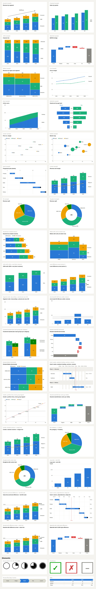

# SSF Charts

An open-source, think-cell-style chart add-in for PowerPoint, built on **Office.js**.

SSF Charts gives you the charts consultants reach for think-cell to make — waterfalls,
Mekko/Marimekko, stacked and clustered columns, 100% charts, lines and areas — with
think-cell's signature annotations (**CAGR arrows, difference arrows, value lines,
column totals, smart segment labels**), inserted into the slide as **native, fully
editable PowerPoint shapes** rather than an opaque OLE object.

<!--
  "NEVER PICTURES" WAS REMOVED FROM THE LINE ABOVE ON 2026-09-13, and it must not
  come back unqualified. The same sentence was struck from docs/STORE-LISTING.md
  on 2026-09-10 for the same reason and this copy was missed — one claim, two
  call sites, which is this repo's most-repeated defect.

  Two paths still produce a picture, and neither is a degradation:
    - `wantsAutoPicture` rasterises a chart with more shapes than the host can
      swallow. Nothing to do with requirement sets; it is the density guard.
    - the user's own "insert as image" choice.
  A third — a picture for marks the host could not draw — is genuinely gone now
  the floor is 1.10, but it is not what made the sentence false.

  "Native, editable shapes" is true and is what to say. "Never pictures" is a
  promise the product does not keep.
-->

<!--
  THE PRODUCT NAME USED TO LIVE IN THIS IMAGE'S PIXELS, WHERE NO GREP COULD
  REACH IT. `docs/gallery.png` was captured at db06298, when this add-in was
  still called PowerChart, and the page heading it photographed read "PowerChart
  demo gallery". `index.html` and this file were renamed; the screenshot was
  not — so a retired name survived on the page BOTH production manifests submit
  as their `<SupportUrl>` (`manifest-prod.xml`, `manifest-excel-prod.xml`),
  which is the first thing a certification reviewer opens. "PowerChart" is also
  Oracle Health's EHR product, so the ghost is a collision as well.

  Fixed by dropping the 89 pixel rows that carried the heading — the band above
  the first card, checked ink-free first — rather than re-rendering text into a
  screenshot nobody took. The title is the alt text and the caption below now,
  where the next rename is one grep away. KEEP IT THERE: do not bake the product
  name back into the pixels. (`GROUP_NAME` / `POWERCHART_CONFIG` in
  `src/render/` are a different thing — lookup keys written into shapes on real
  decks, which is why they were not swept.)
-->



_Every chart above is produced by the same layout engine the PowerPoint add-in
uses — here rendered to SVG, in PowerPoint rendered as native editable shapes._

## Try it

- **Live demo gallery** (no install, renders in the browser):
  <https://ssf-chart.struktureretsundfornuft.dk/>
- **Install in PowerPoint** (sideload the add-in):
  1. Download **`manifest-prod.xml`** from the [latest release](../../releases/latest)
     (Excel companion: `manifest-excel-prod.xml`).
  2. PowerPoint on the web → open a deck → **Home ▸ Add-ins ▸ More add-ins ▸
     My Add-ins ▸ Upload My Add-in** → pick the manifest. (Desktop Windows/Mac:
     see the [publishing runbook](docs/PUBLISHING.md#phase-2--sideload-in-powerpoint-owner-agent-assists).)
  3. The **SSF Charts** group appears on the Home tab — open the pane and insert.
  - Requires PowerPoint with the Office **PowerPointApi 1.10+** requirement set:
    **Microsoft 365 on Windows from Version 2601**, **Mac 16.105+**, or
    PowerPoint on the web. **Not** volume-licensed/LTSC Office or iPad —
    Microsoft lists 1.6 and later as _Not available_ there, so no update brings
    them into range.
- **Use it from Claude** (headless chart generation): the
  [`skill-latest`](../../releases/tag/skill-latest) release ships
  `ssf-charts.zip` — upload it under claude.ai → Settings → Capabilities
  → Skills.

## Feature overview

**[User manual](docs/MANUAL.md)** — how to use the pane, the datasheet
conventions, and every option.

<!--
  A CAPABILITY LIST, NOT A COMPETITOR COMPARISON. This header cell read
  "think-cell feature" until 2026-09-20, which made the 168 rows below it — four
  fifths of this file by bytes — read as comparative advertising against a named
  competitor, on the page both production manifests give as their
  `<SupportUrl>`. That is the page a Microsoft certification reviewer lands on.

  docs/STORE-LISTING.md already carries the rule ("the public listing, name,
  description, and screenshots must **not** use the 'think-cell' mark as
  branding … internal docs may keep it"), and PUBLISHING.md repeats it. Its own
  checklist line — "Listing copy above is trademark-clean" — was only ever
  applied to the copy in that file, while the Support URL it prints a few lines
  later points here. Store-facing is a property of where a page is SUBMITTED,
  not of which directory it sits in.

  Renaming the header was the whole fix: no row below ever named the competitor,
  so the rows stay where contributors already look for them (CLAUDE.md: "Any
  feature change must update … 4. README feature table"). The nominative
  mentions in the intro and the Disclaimer are positioning, which is the owner's
  call, and are left alone. `test/support-url-page.test.ts` holds this.
-->

| Capability                                                                       | SSF Charts                                                                                                                                  |
| -------------------------------------------------------------------------------- | ------------------------------------------------------------------------------------------------------------------------------------------- |
| Stacked / clustered / 100% column charts                                         | ✅                                                                                                                                          |
| Stacked waterfall (multi-series deltas)                                          | ✅                                                                                                                                          |
| Clustered-stacked charts (blank datasheet rows split stacks)                     | ✅                                                                                                                                          |
| Rotation for waterfall & Mekko (not just columns)                                | ✅                                                                                                                                          |
| Global label de-collision pass (outside labels never overlap)                    | ✅                                                                                                                                          |
| Datasheet formulas (`=B2-B3`, `SUM`/`AVG`/`MIN`/`MAX`, ranges)                   | ✅                                                                                                                                          |
| Saved chart templates                                                            | ✅ (localStorage)                                                                                                                           |
| Corporate style file (import/export JSON defaults)                               | ✅                                                                                                                                          |
| Deck-level style (travels with the .pptx, not the browser)                       | ✅ (custom XML part, PowerPointApi 1.7)                                                                                                     |
| Same Scale on the current selection                                              | ✅                                                                                                                                          |
| Scatter partition lines, trend line, group legend                                | ✅ (`X line`/`Y line`/`Trend` rows)                                                                                                         |
| Gantt weeks + weekend shading, section headers, indent, remarks                  | ✅ (`>` prefix, `Activity \| Owner \| Remark`)                                                                                              |
| Gantt holidays + bracket annotations                                             | ✅ (`Holiday`, `Bracket <label>` rows)                                                                                                      |
| Gantt numeric table columns (cost / FTE / days)                                  | ✅ (`Column <label>` rows, beside the task labels)                                                                                          |
| Gantt working-day timeline (bar length = working days)                           | ✅ (`gantt.workdays`; `true` = Mon–Fri, or ISO weekday numbers)                                                                             |
| Scatter/bubble marginal distribution histograms                                  | ✅ (`decorations.marginals: "x"/"y"/"both"`; bins subdivide the axis ticks)                                                                 |
| Bubble overlap relief along one axis (disclosed)                                 | ✅ (`scatter.spread: "x"/"y"` + `spreadLimit`; cap printed in the footnote)                                                                 |
| Scatter/bubble marker symbols per group                                          | ✅ (`scatter.markers`; preset geometry, area-matched, legend draws the shapes)                                                              |
| Heatmap sign marks (greyscale-safe diverging)                                    | ✅ (`heatmap.symbols: "sign"`; +/− where no value label carries the sign)                                                                   |
| Combo benchmark markers (points, no connecting line)                             | ✅ (`type: "marker"` on a combo series; shares the columns' scale)                                                                          |
| Waterfall "of which" detail columns (off the chain)                              | ✅ (`waterfall.detailGroups: [{of, indices}]`; the bridge steps over them)                                                                  |
| Gantt lanes grouped by owner                                                     | ✅ (`gantt.lanes: "owner"`; opt-in, stable, `After` renumbered)                                                                             |
| Category sorting by total                                                        | ✅                                                                                                                                          |
| Combo secondary (right) value axis                                               | ✅                                                                                                                                          |
| Label content menu on line & scatter labels                                      | ✅                                                                                                                                          |
| Connector lines on stacked columns/bars                                          | ✅ (`decorations.connectors`)                                                                                                               |
| Single data-point highlight color                                                | ✅ (per-cell `series.colors`)                                                                                                               |
| Speech-bubble callouts on a value                                                | ✅ (`decorations.callouts`)                                                                                                                 |
| Shaded background bands (axis regions)                                           | ✅ (`decorations.bands`, incl. scatter)                                                                                                     |
| Exploding pie slice                                                              | ✅ (`pie.explode`)                                                                                                                          |
| Footnote/source line + "100% = N" note                                           | ✅ (`footnote`, `decorations.hundredPercentNote`)                                                                                           |
| Rule-based tables (no side borders, group gaps, totals row)                      | ✅ (default table style; `{style:"grid"}` keeps the old look)                                                                               |
| In-cell table effects (harvey balls, trend arrows, semantic colors)              | ✅ (`[hb:0.75]`, `[up]`/`[down]`/`[flat]`, `[good]`/`[bad]`)                                                                                |
| Trend line fit statistics (R², p-value)                                          | ✅ (automatic with the `Trend` row)                                                                                                         |
| Pattern/hatch fills on series                                                    | ✅ (`series.pattern`, SVG/preview; solid in PPT)                                                                                            |
| Boxplot (five-number rows or raw samples with Tukey whiskers)                    | ✅ (`boxplot` kind, vertical & horizontal, shared axis across boxes)                                                                        |
| Radar/spider chart (translucent polygons)                                        | ✅ (`radar` kind; filled in SVG+pptx, outline in live add-in)                                                                               |
| Heatmap (sequential/diverging color matrix)                                      | ✅ (`heatmap` kind)                                                                                                                         |
| Map charts as tile-grid cartograms (US / EU / Europe / World)                    | ✅ (`tilemap` kind, auto-detected layouts)                                                                                                  |
| Tufte datamark axes (ticks only, range-frame option)                             | ✅ (`valueAxis: "datamarks"`, `tickMode: "data"`)                                                                                           |
| Combo value-label priority when a frame is too small for both rows               | ✅ (`tightLabelPriority: "columns" \| "line"`)                                                                                              |
| Error bars (symmetric or asymmetric)                                             | ✅ (`Error` / `Error+` / `Error-` datasheet rows)                                                                                           |
| Palette from the presentation theme (Accent1-6)                                  | ✅ (pane → "Use deck theme", PowerPointApi 1.10)                                                                                            |
| Cascade / decomposition chart (stage-by-stage breakdown)                         | ✅ (`cascade` kind)                                                                                                                         |
| Bullet charts (target ticks + range bands)                                       | ✅ (`Target` row + `decorations.bands`)                                                                                                     |
| Combo with clustered or 100% columns                                             | ✅ (`combo.columns`)                                                                                                                        |
| Bubble size legend (automatic)                                                   | ✅                                                                                                                                          |
| Forecast styling on lines (dashed + hollow markers)                              | ✅ (`decorations.forecastFrom`)                                                                                                             |
| Scatter quadrant matrix (zones + labels in one step)                             | ✅ (`decorations.quadrants`)                                                                                                                |
| Funnel / pyramid chart with conversion rates                                     | ✅ (`funnel` kind)                                                                                                                          |
| Lollipop, dot-plot, and dumbbell-range styles                                    | ✅ (`decorations.barStyle` on clustered)                                                                                                    |
| Gantt progress fill + plan-vs-actual baselines                                   | ✅ (`% Complete`, `Baseline start`/`end` rows)                                                                                              |
| Grouped boxplots (two categorical dimensions)                                    | ✅ (`Min \| 2024`-style row suffixes)                                                                                                       |
| Waterfall budget-vs-actual (hatched gap to target)                               | ✅ (`Target` row on waterfalls)                                                                                                             |
| Confidence bands + plan-vs-actual ribbons on lines                               | ✅ (`Band low`/`Band high` rows, `decorations.fillBetween`)                                                                                 |
| Heatmap marginal totals                                                          | ✅ (`heatmap.totals`)                                                                                                                       |
| Slope chart (before/after, labels both ends)                                     | ✅ (`decorations.slope` on line)                                                                                                            |
| Waffle chart (10×10 unit grid, one dominant share)                               | ✅ (`waffle` kind)                                                                                                                          |
| KPI / number tile (big number + delta arrow)                                     | ✅ (Elements section, `↓ good` flip)                                                                                                        |
| Bar-of-pie breakout (top-N + "Other" detailed)                                   | ✅ (`pie.breakout`)                                                                                                                         |
| Small multiples (grid of panels, one shared scale)                               | ✅ (`multiples: {columns?}`)                                                                                                                |
| Stepped line & area (staircase, jump before/after/center)                        | ✅ (`decorations.stepped`)                                                                                                                  |
| Column gap width & clustered bar overlap (Excel-style)                           | ✅ (`gapWidth` 0–500, `overlap` −100…100)                                                                                                   |
| Butterfly value ticks & gridlines on both flanks                                 | ✅ (`valueAxis`/`gridlines` on `butterfly`)                                                                                                 |
| Area charts with negative values (dip below the baseline)                        | ✅ (`area`, positives up / negatives down)                                                                                                  |
| Scatter/bubble trajectory trail (Gapminder-style path)                           | ✅ (`decorations.trajectory`)                                                                                                               |
| Boxplot jittered raw-data dots over the box                                      | ✅ (`boxplot.jitter`, raw-sample mode)                                                                                                      |
| Scatter/bubble continuous color scale (a third variable)                         | ✅ (`Color` row → sequential ramp + gradient legend)                                                                                        |
| Smoothed line charts (Catmull-Rom curves)                                        | ✅ (`decorations.smooth`)                                                                                                                   |
| Waterfall grouping spacers (section gaps in the bridge)                          | ✅ (`waterfall.spacerIndices`)                                                                                                              |
| Gantt auto-summary bars on section rows                                          | ✅ (`decorations.summaryBars`)                                                                                                              |
| Notched boxplots (median confidence interval)                                    | ✅ (`boxplot.notch`, raw-sample mode)                                                                                                       |
| Radar min–max "peer range + us" band                                             | ✅ (`decorations.radarBand`)                                                                                                                |
| Automatic "Other" bucket for long-tail series                                    | ✅ (`otherBucket: {max}`)                                                                                                                   |
| Calendar heatmap (weekday × week contributions grid)                             | ✅ (`heatmap.calendar`)                                                                                                                     |
| Butterfly with stacked flanks (>1 series per side)                               | ✅ (`butterfly: {split}`)                                                                                                                   |
| Radar per-spoke scales (mixed KPI units)                                         | ✅ (`radar: {perSpoke}`)                                                                                                                    |
| Missing-data bridge on line charts                                               | ✅ (`decorations.bridgeGaps`)                                                                                                               |
| Transparent floating column segments                                             | ✅ (series `color: "transparent"`)                                                                                                          |
| Combo with a waterfall or Mekko base under the lines                             | ✅ (`combo.columns: "waterfall" \| "mekko"`)                                                                                                |
| Combo with independent per-line axes (mixed-unit KPIs)                           | ✅ (`combo.lineAxes: "independent"`)                                                                                                        |
| Hexagonal tile maps                                                              | ✅ (`tilemap.shape: "hex"`)                                                                                                                 |
| Per-region mini-glyphs (bars) on tile maps                                       | ✅ (`tilemap.glyph: "bars"`)                                                                                                                |
| 100% charts with negative segments (below the axis)                              | ✅ (`stacked100`)                                                                                                                           |
| Semi-circle / gauge-style half doughnut                                          | ✅ (`doughnut` + `pie.semi`)                                                                                                                |
| Pareto chart (sorted bars + cumulative % line)                                   | ✅ (`pareto: true`)                                                                                                                         |
| Bump chart (rank over time)                                                      | ✅ (`line` + `decorations.bump`)                                                                                                            |
| Horizontal profile chart (rotated line/area)                                     | ✅ (`horizontal` on `line`/`area`)                                                                                                          |
| Treemap (squarified, area ∝ value, 2-level grouping)                             | ✅ (`treemap` kind, `"Group \| Item"` categories)                                                                                           |
| Sunburst (nested hierarchical rings)                                             | ✅ (`sunburst` kind, `"Group \| Item"` categories)                                                                                          |
| Violin plot (kernel-density distributions)                                       | ✅ (`violin` kind, raw samples; outline-only in the live add-in)                                                                            |
| Candlestick / OHLC financial chart                                               | ✅ (`candlestick` kind, `Open`/`High`/`Low`/`Close` rows)                                                                                   |
| Gantt critical-path highlight                                                    | ✅ (`decorations.criticalPath`, over `After` edges)                                                                                         |
| Mean±SD boxplot variant                                                          | ✅ (`boxplot.meanSd`, raw-sample mode)                                                                                                      |
| Grand total label (sum of all category totals)                                   | ✅ (`decorations.grandTotal`, stacked/clustered columns)                                                                                    |
| IBCS scenario notation (AC/PY/PL/BU/FC by fill)                                  | ✅ (`series.scenario`; solid / lighter / hollow / hatched)                                                                                  |
| IBCS variance tier (Δ / Δ% vs plan or prior year)                                | ✅ (`decorations.variance`; signed bars below the columns, green/red)                                                                       |
| Polynomial scatter trendlines (quadratic / cubic / quartic)                      | ✅ (`scatter.trendDegree` 2–4; sampled curve, R² stated)                                                                                    |
| Sparklines (word-sized trend lines)                                              | ✅ (`decorations.sparkline` on `line`/`area`; pair with `multiples`)                                                                        |
| Radial bar chart / Nightingale rose                                              | ✅ (`radar` + `radar.bars`; series stack outward)                                                                                           |
| Stacked radar (part-to-whole per spoke)                                          | ✅ (`radar` + `radar.stacked`)                                                                                                              |
| Variable-radius pie (angle + radius encode two metrics)                          | ✅ (`pie.variableRadius` or a `Radius` row)                                                                                                 |
| Cell-size heatmap (corrplot: area = magnitude)                                   | ✅ (`heatmap.sizeEncode`)                                                                                                                   |
| Heatmap row clustering + dendrogram                                              | ✅ (`heatmap.cluster`, average linkage)                                                                                                     |
| Combo stacked-area base under the lines                                          | ✅ (`combo.columns: "area"`)                                                                                                                |
| Selection awareness (select a chart → edit banner)                               | ✅                                                                                                                                          |
| Insert into selected placeholder bounds; chart size controls                     | ✅                                                                                                                                          |
| Datasheet keyboard navigation + insert/delete at cursor                          | ✅                                                                                                                                          |
| Auto-update mode (edits push to the slide live)                                  | ✅                                                                                                                                          |
| Ribbon menu with per-chart-type entries                                          | ✅ (`?kind=` deep links)                                                                                                                    |
| Dark-mode pane, busy/status feedback, translation-ready pane (see i18n.ts)       | ✅                                                                                                                                          |
| **Claude Agent Skill** (charts as native shapes from any Claude surface)         | ✅ download from the [skill-latest release](../../releases/tag/skill-latest) (rebuilt by CI on every merge), or `npm run skill` locally     |
| Image render mode (`render: "image"`, one raster per chart)                      | ✅ pane (**Insert as picture**) + skill CLI — dense charts sidestep the web dense-shape wall; **Explode to native shapes** converts back    |
| Claude integration research & plan                                               | 📋 [docs/CLAUDE-INTEGRATION.md](docs/CLAUDE-INTEGRATION.md)                                                                                 |
| Combo chart (stacked columns + line series)                                      | ✅ (`type: "line"` on a series)                                                                                                             |
| Pie & doughnut                                                                   | ✅ (SVG exact; PowerPoint via triangle fans, needs 1.10 rotation)                                                                           |
| Bar charts as rotated column charts, butterfly charts                            | ✅ (`horizontal` toggle, `butterfly` kind)                                                                                                  |
| Waterfall with computed totals (`e` cells) and connectors                        | ✅                                                                                                                                          |
| Mekko (Marimekko) with %-axis and column totals                                  | ✅                                                                                                                                          |
| Mekko with units (`X extent` row)                                                | ✅                                                                                                                                          |
| Line & area charts                                                               | ✅                                                                                                                                          |
| Smart segment labels (auto-hidden when they don't fit, auto contrast ink)        | ✅                                                                                                                                          |
| Column totals                                                                    | ✅                                                                                                                                          |
| CAGR arrow (`+x.x% p.a.`)                                                        | ✅                                                                                                                                          |
| Total & level difference arrows (%/absolute delta)                               | ✅                                                                                                                                          |
| Value lines (multiple; fixed values or mean Ø)                                   | ✅                                                                                                                                          |
| Series labels placed at the last column (de-overlapped)                          | ✅                                                                                                                                          |
| Excel-style datasheet with TSV paste, transpose, `100%=` row                     | ✅ (task pane grid)                                                                                                                         |
| Scatter & bubble with collision-avoiding point labels                            | ✅ (`X`/`Y`/`Size`/`Group` rows)                                                                                                            |
| Gantt / timeline with milestones — numeric or **calendar dates**                 | ✅ (`Start`/`End`/`Milestone` rows; ISO/`dd.mm.yyyy`/"Jan 2026" dates)                                                                      |
| Value-axis breaks (compress an out-of-scale range)                               | ✅                                                                                                                                          |
| Same Scale across all charts in the deck                                         | ✅ (re-renders every chart to a shared scale)                                                                                               |
| Segment order menu (sheet / reversed / ascending / descending)                   | ✅                                                                                                                                          |
| Manual value-axis scale (pin min and/or max)                                     | ✅                                                                                                                                          |
| Number format control (decimals, suffix, locale)                                 | ✅                                                                                                                                          |
| Label content menu (value / % / series / category combos)                        | ✅                                                                                                                                          |
| Palette presets + per-series color pickers                                       | ✅                                                                                                                                          |
| Axis title, log scale, date-spaced line x-axis                                   | ✅                                                                                                                                          |
| Difference arrows anchored to value lines, per-series CAGR                       | ✅                                                                                                                                          |
| JSON automation (export/import/batch insert + `npm run render` CLI)              | ✅                                                                                                                                          |
| Download the preview as SVG or PNG (for email / chat)                            | ✅ (overflow menu; PNG rasterized at 2×)                                                                                                    |
| Copy a shareable chart link (config in the URL hash)                             | ✅ (reopens the exact chart on the hosted gallery)                                                                                          |
| Datasheet undo/redo (Ctrl+Z / Ctrl+Y)                                            | ✅                                                                                                                                          |
| Very dense charts auto-insert as a picture on the web (still editable)           | ✅ (past ~90 shapes; **Explode** turns them back)                                                                                           |
| Whole deck inserted as one generated .pptx (grouped + tagged in the file)        | ✅ (**Fast path**, on by default; falls back to shape-by-shape when the host can't take it)                                                 |
| Generated decks match the destination's slide size (no rescale on insert)        | ✅ (read from `PageSetup` at 1.10, an exported slide at 1.8, or `getFileAsync` below that)                                                  |
| Second chart placed beside or below the first, whichever leaves it bigger        | ✅ (measured against the deck's real width — beside on 16:9, below on 4:3)                                                                  |
| Update survives a host that won't redraw (off-screen, slide swap, picture)       | ✅ (three fallbacks, least disruptive first; parks on a scratch slide when the deck has none to spare)                                      |
| Stop a long insert, deck run or Same scale mid-flight                            | ✅ (**Stop**; halts at the next slide/chart/batch — the host cannot abort a round trip in flight)                                           |
| Demo deck self-repair (duplicate slides, false banners, loose charts)            | ✅ (automatic at the end of every run)                                                                                                      |
| Run log export (per-item timings, host verdicts, verbose trace, as JSON)         | ✅ (**Download run log**)                                                                                                                   |
| A run that crashes still leaves a log                                            | ✅ (steps written to browser storage as they happen; **Download the crashed run** on the next open, readable by `npm run triage` alone)     |
| Host conformance probe (is the fake PowerPoint the tests use actually faithful?) | ✅ (**Run host probe** → `npm run host-diff` against the fake's frozen answer sheet)                                                        |
| A host that stops answering mid-write does not lose the work                     | ✅ (a bounded write re-reads the document instead of trusting the promise — office-js#1650: the sync hangs, the slide lands)                |
| Agenda / chapter slides (one per chapter, current highlighted)                   | ✅ (appended to the deck)                                                                                                                   |
| Harvey balls, checkboxes, process flow, table element                            | ✅ (Elements section)                                                                                                                       |
| Gantt: responsible column, dependency arrows, today line, quarter scale          | ✅ (`Activity \| Owner`, `After`/`Today` rows)                                                                                              |
| Excel data bridge (selection → chart JSON → paste to refresh)                    | ✅ (`manifest-excel.xml` companion)                                                                                                         |
| Manual label nudging (config-driven)                                             | ✅ (`labelOffsets`)                                                                                                                         |
| Pie leader lines for outside labels                                              | ✅                                                                                                                                          |
| Visual-regression snapshots + fuzz tests in CI                                   | ✅                                                                                                                                          |
| Nothing drawn outside the chart's own box, at any size or font                   | ✅ (gated: 25 kinds × 8 frames × 7 font sizes, 60x300–960x540, 6–32pt, plus every decoration and every top-level option, both orientations) |
| No label drawn on top of another, at any size or font                            | ✅ (gated: 25 kinds × 7 frames × 7 font sizes × both orientations; one declared exception)                                                  |
| Chrome yields to the title when a frame cannot carry both                        | ✅ (axis strip / legend / colour key dropped, title kept — see docs/MANUAL.md)                                                              |
| Visual chart gallery (Elements-style thumbnails)                                 | ✅                                                                                                                                          |
| Output as native, editable PowerPoint shapes                                     | ✅ (grouped)                                                                                                                                |
| Re-edit inserted charts (config persisted in shape tags)                         | ✅ ("Edit selected chart")                                                                                                                  |
| _Live_ Excel data links, in-canvas drag handles                                  | 🚧 out of Office.js reach (see docs/RESEARCH.md; the Excel bridge above is the sandbox-safe substitute)                                     |

## How it works

```
datasheet / config ──▶ layout engine (pure TS) ──▶ scene graph ──▶ SVG renderer (preview, tests)
                                                              └──▶ Office.js renderer (native shapes)
```

- **`src/core`** — the layout engine. Pure TypeScript, no Office.js dependency:
  chart layouts, value scales with nice ticks, label fitting/contrast, decorations.
  Deterministic and fully unit-testable.
- **`src/render/svg.ts`** — renders a scene to SVG for the live preview, the demo
  gallery, and visual tests.
- **`src/render/powerpoint.ts`** — renders the same scene as native PowerPoint
  shapes via the Office.js Shape API (`addGeometricShape`, `addLine`, `addTextBox`),
  then groups them. Every bar, label and arrow stays editable in PowerPoint.
- **`src/taskpane`** — the add-in UI: chart gallery, editable datasheet (paste
  straight from Excel), decoration toggles, live preview, insert button.

See [docs/ARCHITECTURE.md](docs/ARCHITECTURE.md) for design details and
[docs/RESEARCH.md](docs/RESEARCH.md) for the deep research on think-cell that
informed this clone.

## Getting started

```bash
npm install
npm run dev        # http://localhost:3000 — demo gallery (no PowerPoint needed)
npm test           # unit tests for the layout engine
npm run build      # production bundle
```

### Try it without PowerPoint

Open `http://localhost:3000/` for the gallery, or
`http://localhost:3000/src/taskpane/taskpane.html` for the full task-pane UI —
outside PowerPoint the **Download SVG** button replaces slide insertion.

### Sideload into PowerPoint

1. Serve the add-in over HTTPS (`npx office-addin-dev-certs install`, then point
   `server.https` in `vite.config.ts` at the generated certs).
2. Sideload `manifest.xml`:
   - **PowerPoint on the web**: Insert → Add-ins → Upload My Add-in.
   - **Windows/Mac desktop**: see the
     [Office add-in sideloading docs](https://learn.microsoft.com/office/dev/add-ins/testing/test-debug-office-add-ins).
3. Open the **SSF Charts** button on the Home tab, pick a chart, paste data,
   and hit **Insert into slide**.

Requires PowerPoint with **PowerPointApi 1.10+** — Microsoft 365 on Windows from
Version 2601, Mac 16.105+, or PowerPoint on the web. Raised from 1.4 on
2026-09-13.

**Why the floor is high, since it costs reach.** Grouping needs 1.8, so below it
a chart arrives as ~40 loose shapes rather than one object. Shape rotation needs
1.10, and without it pie slices, doughnuts, sunbursts, radial bars and CAGR
arrows cannot be drawn at all: measured over the 123 charts shipped here, 18
lose ink and 9 lose their subject entirely. The add-in used to degrade — insert
a complete picture and say so — and that path is gone with the floor, because on
every host now admitted it can never trigger. The reasoning, including why a
lower floor _enlarges_ rather than narrows what Microsoft certifies, is in
`manifest.xml`.

## Datasheet conventions

- Row 1 = category names, column A = series names — the same mental model as
  think-cell's internal datasheet. **⇄ Transpose** swaps the two.
- Paste a range straight from Excel (TSV) into any cell.
- **Waterfall**: one series of deltas; type `e` (or `=`) in a cell to draw a
  computed running total at that category, exactly like think-cell's `e` cells.
- **`100%=` row**: name a row `100%=` to set per-category denominators for
  100% charts — columns whose series sum to less stay short of full height.
- **`X extent` row**: name a row `X` or `X extent` to give a Mekko explicit
  column widths (think-cell's "Mekko with units").
- **Re-editing**: select an inserted SSF chart on the slide and press
  **Edit selected chart** — the pane reloads its data and "Update chart"
  replaces it in place.

## Disclaimer

SSF Charts is an independent open-source project. It is not affiliated with,
endorsed by, or derived from think-cell Software GmbH. "think-cell" is a
trademark of its owner; it is referenced here only to describe compatibility
of concepts.
